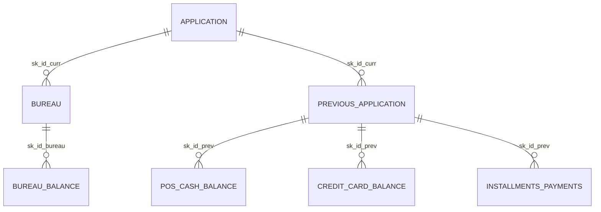

# Entity relationship diagram

```mermaid
erDiagram
  APPLICATION ||--o{ BUREAU : "sk_id_curr"
  APPLICATION ||--o{ PREVIOUS_APPLICATION : "sk_id_curr"
  BUREAU ||--o{ BUREAU_BALANCE : "sk_id_bureau"
  PREVIOUS_APPLICATION ||--o{ POS_CASH_BALANCE : "sk_id_prev"
  PREVIOUS_APPLICATION ||--o{ CREDIT_CARD_BALANCE : "sk_id_prev"
  PREVIOUS_APPLICATION ||--o{ INSTALLMENTS_PAYMENTS : "sk_id_prev"
```
APPLICATION = application_train + application_test (one row per customer).
